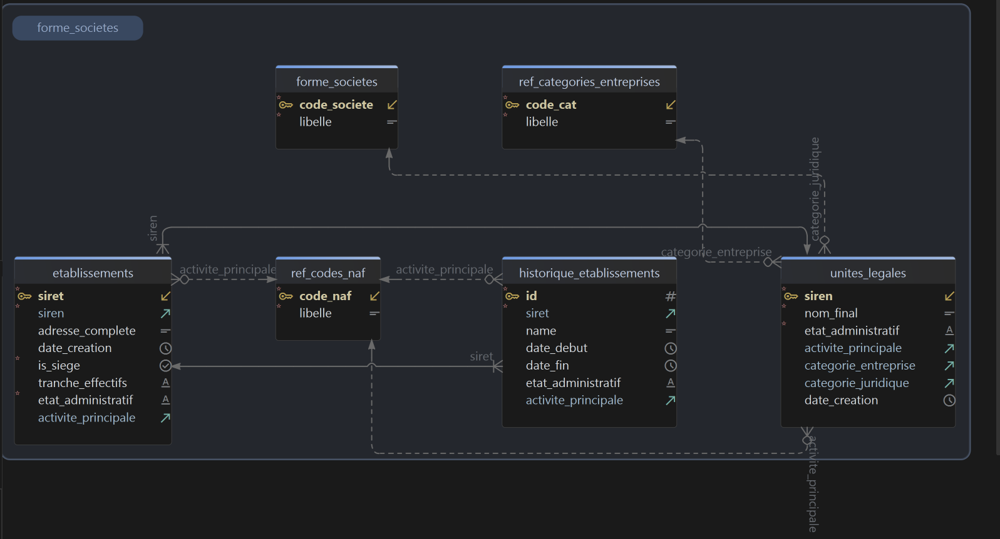

# KYC-Insight — Know Your Customer

Project for exploring and enriching SIRENE data for KYC (Know Your Customer) use cases.

## Description

This repository contains ETL tools, a FastAPI service to expose processed data, and a Streamlit UI to query a SIRET and visualize company/site information.

## Database schema



## Repository layout (summary)

- `accueil.py`: main Streamlit app (frontend).
- `requirements.txt`: Python dependencies.
- `api/main.py`: FastAPI service (GET /{siret} endpoint).
- `load_into_db/`: ETL scripts to transform and load SIRENE data into postgres tables.
- `lake_files/`: source files / CSV and parquet inputs (e.g., `forme_societes.csv`, `StockEtablisement_utf8.parquet`).
- `utils/`: utilities (e.g., `get_db_url.py`, SQL scripts `initdb.sql`, etc.).
- `vues/`: Streamlit UI components (page renderers).

## Prerequisites

- Python 3.10+ (or 3.11)
- PostgreSQL (target database)
- `git` (optional)

Python dependencies are listed in `requirements.txt`.

## Installation (local, Windows PowerShell)

1. Clone the repository:

```powershell
git clone <repo-url>
cd <repo>
```

2. Create and activate a virtual environment:

```bash
python -m venv .venv
source .venv\bin\activate
```

3. Install dependencies:

```bash
pip install -r requirements.txt
```

## Environment variables

Create a `.env.secrets`  file at the repo root (or adjust the path) with at least:

```
DB_USER=my_user
DB_PASS=my_password
DB_HOST=localhost
DB_PORT=5432
DB_NAME=my_database
API_URL=http://localhost:8000
```

- `DB_*`: used by ETL scripts and the API to connect to PostgreSQL.
- `API_URL`: used by the Streamlit app (`accueil.py`) to call the API (e.g., `http://localhost:8000`).

NOTE: `utils/get_db_url.py` builds the PostgreSQL URI from the variables above.

## Initialize the database

1. Connect to PostgreSQL (example with psql):

```bash
# example
psql -h localhost -U postgres
```

2. Run the table creation script: you can do it as user postgres or you can create your own user and then make sure  you use that user in .env.secrets

```bash
psql -h $DB_HOST -U $DB_USER -d $DB_NAME -f utils/initdb.sql
```

Adjust paths and files as needed.

## Load data (ETL)

ETL scripts live in `load_into_db/`:


- `naf_etl.py`
- `forme_societe_etl.py`
- `cat_entreprise_etl.py`
- `unite_legale_etl.py`
- `etablissements_etl.py`
- `hist_etab_etl.py`

Example for running an ETL script:

```bash
python load_into_db/unite_legale_etl.py
```

Scripts expect the source files to be available in `lake_files/`. Check the expected file names and adjust the scripts if needed.

## Full procedure (validated order)

The order below matches a clean installation that works with the current pipeline.

1. Create the PostgreSQL database.
2. Run `utils/initdb.sql` (table creation).
3. Run ETL scripts in this order:
   - `load_into_db/naf_etl.py`
   - `load_into_db/cat_entreprise_etl.py`
   - `load_into_db/forme_societe_etl.py`
   - `load_into_db/unite_legale_etl.py`
4. Before `etablissements_etl.py`, run:
   - `utils/extra_db.sql` (add missing NAF codes)
5. Run:
   - `load_into_db/etablissements_etl.py`
   - `load_into_db/hist_etab_etl.py`
6. Run `utils/mv.sql` to create materialized views (including the view used by the API).
7. Start the API:

```bash
python -m uvicorn api.main:app --reload --host 0.0.0.0 --port 8000
```

8. Start Streamlit:

```bash
streamlit run accueil.py
```

## Run the API

The FastAPI service is in `api/main.py`. For development (auto reload):

```bash
python -m uvicorn api.main:app --reload --host 0.0.0.0 --port 8000
```

Main endpoint:

- `GET /{siret}`: returns data for the requested SIRET (e.g., `http://localhost:8000/12345678901234`).

## Run the Streamlit UI

The UI is `accueil.py` (uses `vues/` for pages). Make sure `API_URL` is set in `.env.secrets` (e.g., `http://localhost:8000`). Then:

```bash
streamlit run accueil.py
```

The app provides a SIRET input (14 digits) and displays the data returned by the API.

## Quick tests

- Check DB connectivity: run a small Python script that imports `utils/get_db_url.py` and attempts a `psycopg2` connection.
- Test the API with `curl` or Postman:

```bash
curl http://localhost:8000/12345678901234
```

## Troubleshooting

- DB connection error: verify `DB_HOST`, `DB_PORT`, `DB_USER`, `DB_PASS`, `DB_NAME` in `.env.secrets`.
- Missing data: make sure ETL scripts ran and expected tables exist.
- API timeout from Streamlit: ensure `API_URL` points to the running uvicorn instance.

## Main dependencies

See `requirements.txt`. Key dependencies: `fastapi`, `uvicorn`, `psycopg2-binary`, `python-dotenv`, `streamlit`, `polars`, `pandas`.

## Contributing

1. Fork and create a feature branch: `git checkout -b feat/my-feature`
2. Add/test your code
3. Open a pull request with a clear description


## Author

Arnel Fokou


